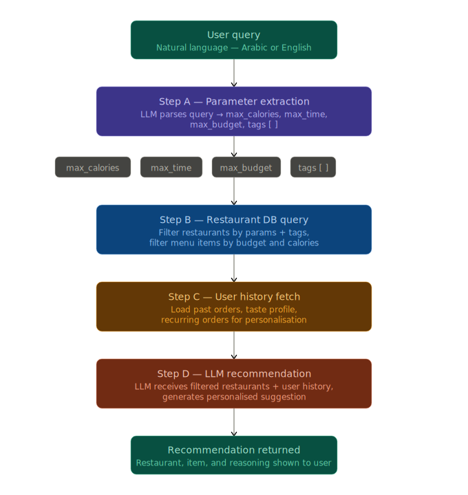

# HungerStation AI Assistant


An intelligent, conversational recommendation agent for food delivery built with Node.js, Express, and Google's Gemini LLM. The AI dynamically adapts to user history, current constraints (time, budget, calorie count), and resolves ambiguities by asking clarifying questions using a modern web interface.

## Architecture & Logic Flow



## Prerequisites
- Node.js installed

## Setup Instructions

1. **Install Dependencies:**
   ```bash
   npm install
   ```

2. **Configure Environment Variables:**
   You must set up your Google Gemini API Key before running the application.

   Create a file named `.env` in the root of the project directory based on the following pattern:
   ```env
   GEMINI_API_KEY=your_actual_gemini_api_key_here
   ```

3. **Run the Server Locally:**
   ```bash
   npm start
   ```

4. **Access the Chat Interface:**
   The server will start at `http://localhost:3000`. Navigate to this URL in your web browser.

## Deployment

This app requires a backend Node.js environment to run securely. You cannot host this on static providers like GitHub Pages.

To host the application:
1. Push your repository to GitHub.
2. Sign up on a platform like **Render**, **Railway**, or **Heroku**.
3. Create a new Node Web Service.
4. Add your `GEMINI_API_KEY` into the provider's Environment Variables or Secrets manager.
5. Deploy using the default `npm start` build command.
